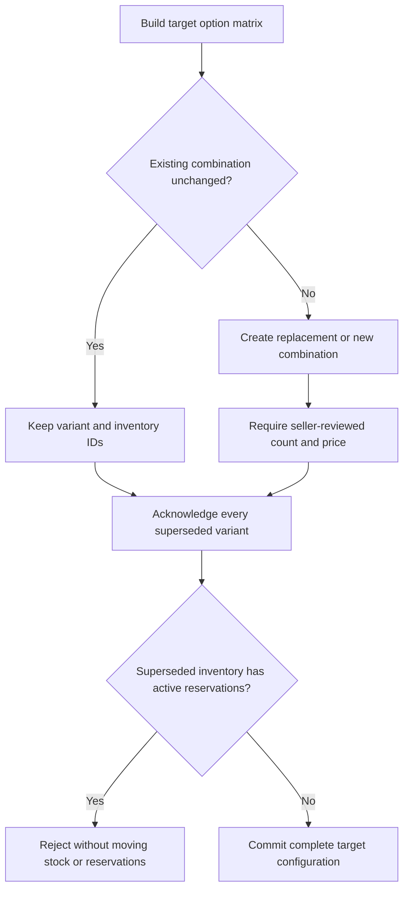

# Add Values Or Expand Dimensions

See the [design](../README.md) and [flow index](../flow.md).

- Adding Green to a Blue/Red option preserves Blue and Red combinations.
- Adding Size to a published Color-only Product changes the old combinations. Color-only identities remain historical; Color/Size combinations receive new identities.
- Counts are not copied into every generated row. The seller must review replacement inventory explicitly.
- An unwanted target combination remains present as inactive; leaving it out would create an incomplete matrix.
