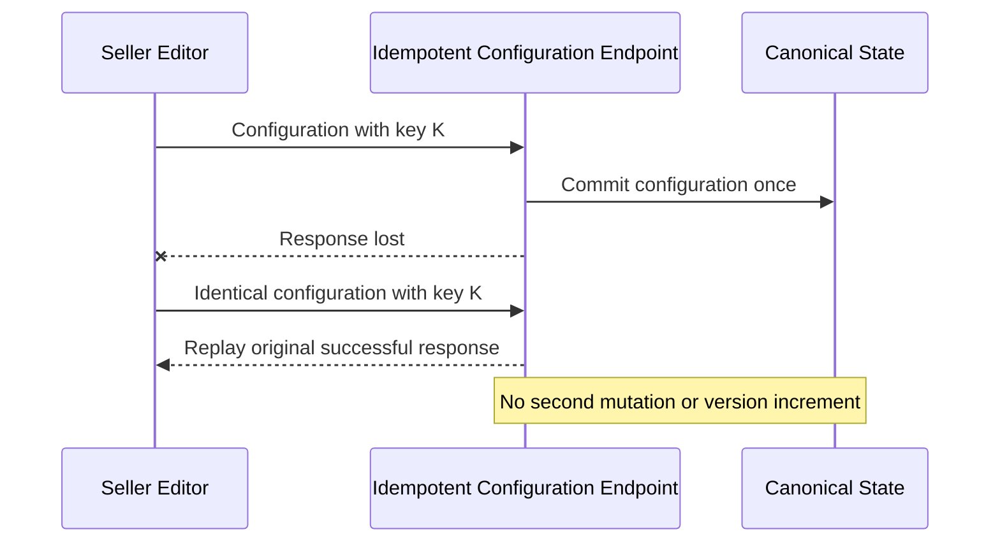

# Retry An Uncertain Request

See the [design](../README.md) and [flow index](../flow.md).

```mermaid
sequenceDiagram
    participant Web as Seller Editor
    participant API as Idempotent Configuration Endpoint
    participant DB as Canonical State
    Web->>API: Configuration with key K
    API->>DB: Commit configuration once
    API--xWeb: Response lost
    Web->>API: Identical configuration with key K
    API-->>Web: Replay original successful response
    Note over API,DB: No second mutation or version increment
```

A changed body is not a retry of the same intent. Never reuse a successful key for a later edit.
