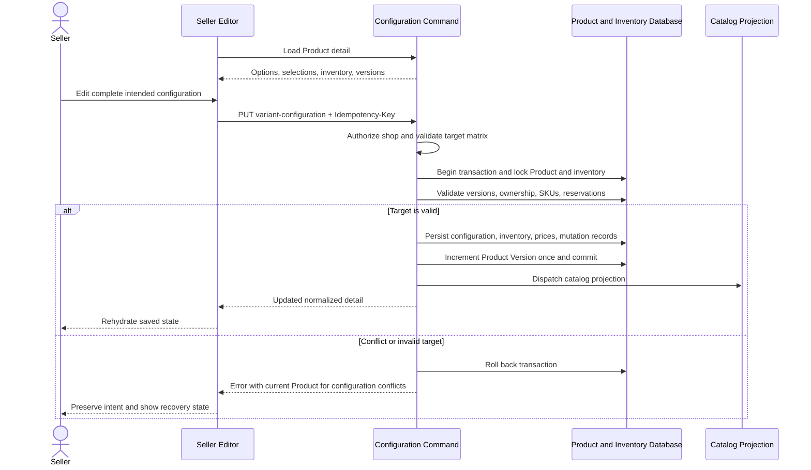

# Save A Complete Configuration

See the [design](../README.md) and [flow index](../flow.md).

The transaction is the configuration boundary, not the whole multi-section seller form. Projection follows the committed canonical state; it is not a substitute for current purchase-eligibility checks.
