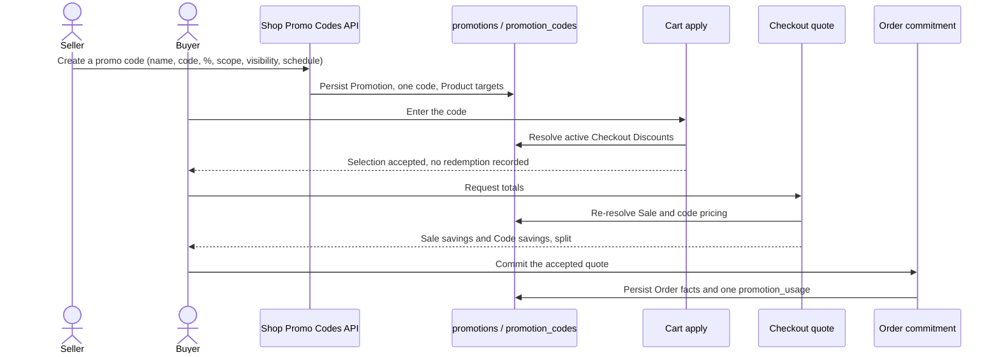

# Promotion Promo Codes

## Overview

A Promo Code activates a **Checkout Discount**: a conditional benefit a buyer
applies at checkout instead of an automatic product price reduction. This slice
builds percentage Checkout Discounts on the shared Promotion model.

Promotion vocabulary is canonical in
[the Promotions context](../../domain/promotions/CONTEXT.md). Sales are described
in [Promotion Sales](../promotion-sales/README.md).

## Goals

- Let a seller create a scheduled or immediate percentage Checkout Discount with
  an ordinary internal name, exactly one redemption code, a visibility, and an
  all-or-selected Product scope.
- Let a buyer enter the code at checkout so the percentage applies to the
  targeted merchandise after Sale pricing and before shipping or tax.
- Report Sale savings and Promo Code savings separately rather than as one
  unexplained adjustment.
- Record a redemption only when an Order is committed.

## Scope

In scope (ticket 03):

- Percentage Checkout Discounts on `promotions` with one `promotion_codes` row,
  optional `promotion_products` targets, visibility, and an explicit timezone.
- Marketing → Promo codes with a listing and a Create a promo code form.
- Manual code entry through the existing cart/quote/Order pipeline, and the
  separate `sale_discount_minor` / `discount_minor` split on quotes and Orders.

Out of scope (later tickets): full promo-code management (08), immutable Order
savings presentation (09), the cutover contraction (10), and the reset/seed
flow (11).

## Vocabulary

- **Checkout Discount**: an offer applied during checkout whose benefit may
  depend on eligibility conditions.
- **Promo Code**: the single code that activates a Checkout Discount. Internal
  Promotion names are ordinary text and are not unique; codes are.
- **Promotion Visibility**: whether a code is publicly discoverable in checkout
  or unlisted and shared directly. Visibility never changes eligibility.
- **Sale savings** (`sale_discount_minor`): the reduction already reflected in
  the priced merchandise.
- **Code savings** (`discount_minor`): the Checkout Discount the applied Promo
  Code grants.

## Design Boundaries

- One rule prices Checkout Discounts: a Promotion code normalizes into a shared
  offer shape, so eligibility and discount math cannot drift between listing and
  redemption.
- A percentage code applies to the Eligible Merchandise Subtotal after Sale
  pricing and before shipping and tax, and to targeted Products only.
- Catalog projection is derived display data; quotes and Order commitment
  re-resolve code eligibility and pricing instead of trusting a projection.
- Applying a code and obtaining a quote record nothing. A `promotion_usages` row
  is written once per applied Promotion and Order inside the commit transaction,
  so a failed commit consumes nothing.
- Optional total and per-buyer redemption limits are checked against the counts
  observed inside the commit transaction, after locking each Promotion row in a
  stable order. Concurrent commitments therefore serialize on the allowance: a
  loser cannot oversubscribe the final redemption, its Order rolls back, and it
  receives refreshed checkout totals to accept before retrying. An omitted limit
  is unlimited; a per-buyer limit requires an authenticated buyer account and
  never falls back to browser identity or an unverified email.
- Retrying a committed submission does not consume twice: the `(promotion,
  order_id)` unique constraint makes the write idempotent, and cancelling or
  refunding an Order never restores its consumed redemption.
- Code exhaustion is an allowance indicator (`exhausted`, `redemption_count`)
  reported separately from the Scheduled / Active / Ended / Cancelled lifecycle
  state, so Active never implies remaining allowance.
- A code string resolves to exactly one offer within a shop, because `(shop_id,
  code)` is unique and a stopped Promotion retains its code.
- Codes are matched case-insensitively and stored upper case. The `(shop_id,
  code)` unique constraint makes them unique per shop and permanently
  unavailable for reuse by another Promotion, since rows are retained.
- Monetary facts keep their creation-time Promotion Currency; a later Shop
  currency change never redefines them.
- When a commitment is refused because a code the buyer applied is no longer
  accepted, the refreshed quote reconciles the buyer's selection to the codes it
  actually accepted, and the shop's Promo Code section explains each removal. No
  chip survives without the discount behind it, and re-acceptance is informed.
- A rejected Promo Code apply (422) carries the evaluator's `reason` next to its
  human `message`, so the storefront renders precise copy ("fully redeemed",
  "sign in to use this promo code", "minimum not met") instead of the one-size
  fallback the message alone must use when the reason is unknown.
- A shop failure answers with a stable `code` next to its human `message`
  (`PROMO_CODE_ALREADY_EXISTS`, `PROMO_CODE_PRODUCT_SCOPE_INVALID`, …). The
  seller app writes its own copy per code and only falls back to `message` for
  codes it does not know, so wording changes never require an API release.

## Main Components

- `PromotionCodeReader` (`MikroOrmPromotionCodeReader`) resolves the active
  Checkout Discounts of a shop.
- `PromoOffer` normalizes a Promotion code into one pricing shape;
  `PromotionPricingService` resolves offers and `evaluatePromoOffer` is the
  single eligibility rule.
- `CreateShopPromoCodeUseCase` / `ListShopPromoCodesUseCase` and
  `ShopPromoCodesController` back `POST`/`GET /v1/shops/:shop_id/promo-codes`,
  including the optional `max_redemptions` / `max_redemptions_per_buyer` limits
  and the derived `redemption_count` / `exhausted` allowance.
- `PromotionRedemptionService` owns the atomic allowance rule: lock, recount,
  reject, and idempotently write `promotion_usages` inside the caller's
  transaction. `assertRedemptionAllowed` is the pure domain rule it applies.
- `OrderCheckoutService` resolves the applied offers, delegates redemption to
  `PromotionRedemptionService`, and persists `sale_discount_minor` alongside
  `discount_minor`. A limit failure is remapped to refreshed checkout totals.
- Seller app `/promo-codes` and `/promo-codes/new`; storefront checkout shows
  Sale savings and Code savings as separate lines.

## Main Flow

## Verification

- `apps/api/api/test/integration/promo-code-creation.int-spec.ts` drives seller
  creation over public HTTP with real persistence: selected Products, duplicate
  code rejection across case, cross-shop reuse, foreign and duplicate targets,
  and reversed or out-of-range schedules.
- `apps/api/api/test/integration/promo-code-redemption.int-spec.ts` drives
  creation, manual application, quote and Order commitment: the code applies
  after a Sale, `sale_discount_minor` stays distinct from `discount_minor`, the
  committed Order keeps the code and the amounts, and no redemption row exists
  until the Order commits.
- `apps/api/api/test/integration/promo-code-redemption.int-spec.ts` also pins the
  allowance behavior: a real-database concurrency test synchronizes two buyers on
  the final redemption and asserts exactly one Order and one usage row, plus
  idempotent retry, cancellation retaining the redemption, and the authenticated
  per-buyer limit. The seller creation/listing contract for the limits is covered
  in `promo-code-creation.int-spec.ts`.
- Unit coverage: `promotion-redemption.spec.ts` (domain rule),
  `promotion-pricing.service.spec.ts`, `create-checkout-quote.service.spec.ts`,
  `checkout-quote-price-freshness.spec.ts`, and `order-checkout.service.spec.ts`.
- Browser smoke (performed against the local stack): the seller created a 15%
  code from Marketing → Promo codes and saw it Active in the listing; the buyer
  entered it at checkout and saw `Sale savings $14.76` and `Code savings $10.09`
  on a `$67.24` merchandise total, then committed the Order.

## Open Questions

- Public Promo Code discovery in the checkout picker is ticket 04.
- Seller-facing management of counts, limits, and exhaustion in the listing is
  ticket 08.
