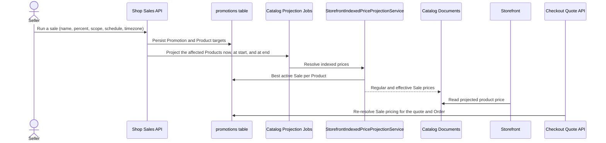

# Promotion Sales

## Overview

A Sale automatically reduces the current regular price of its targeted Products
by a percentage during an explicit Promotion Period. It has no redemption code
and no checkout conditions. Sales and Promo Codes share the Promotion model, and
sellers create and schedule Sales from Marketing → Sales → Run a sale.

Promotion vocabulary is canonical in [the Promotions context](../../domain/promotions/CONTEXT.md).

## Goals

- Let a seller create a scheduled or immediate percentage Sale with an ordinary
  internal name, all-or-selected Product scope, and an explicit timezone.
- Show regular and effective Sale prices on the storefront when the reduction is
  genuine.
- Keep catalog projection derived display data and the checkout quote/Order
  pricing authoritative.
- Keep one shared Promotion engine for Sales and Promo Codes, without permanent
  compatibility aliases.

## Scope

In scope (ticket 01):

- The `promotions`, `promotion_products`, `promotion_codes`, and
  `promotion_usages` tables and the Promotion read port used by pricing.
- Percentage Sales: creation, listing, catalog display pricing, and checkout
  pricing.
- Marketing → Sales with a Run a sale form, preview, timezone, and
  Start sale / Schedule sale.

Out of scope (later tickets): overlapping-Sale selection rules and Sale
lifecycle stop actions (02), Promo Code creation and redemption (03-08),
redemption limits (07), immutable Order savings presentation (09), the cutover
contraction (10), and the reset/seed flow (11).

## Vocabulary

- **Sale**: an automatic, scheduled percentage reduction with no code.
- **Promotion Product Scope**: all of the shop's Products (including future
  ones) or explicitly selected Products; an eligible Product includes all of its
  purchasable Product Variants.
- **Promotion Period**: inclusive start, exclusive end.
- **Promotion Currency**: the shop currency snapshotted at creation.

## Design Boundaries

- Catalog projection is derived display data. The checkout quote and Order
  commitment re-resolve Sale pricing through the same rule instead of trusting a
  projection document.
- Overlapping reductions never compound: the highest matching active Sale
  percentage wins.
- The reduction applies to the Product's current regular price, never a frozen
  creation-time base.
- Seller schedules are authored as local wall clocks in an explicit IANA
  timezone. A spring-forward local time is rejected and a fall-back repeat
  requires an explicit UTC offset; the retained timezone is never reinterpreted.
- Explicit Product targets are validated for ownership and uniqueness; foreign
  shop targets and duplicates are rejected.

## Main Components

- `promotion` domain: `PromotionEntity`, `PromotionProductEntity`,
  `PromotionCodeEntity`, `PromotionUsageEntity`, `resolvePromotionStatus`,
  `local-date-time` (DST resolution), and `SaleProjectionReader`
  (`MikroOrmSaleProjectionReader`).
- `ShopSalesController` with `CreateShopSaleUseCase` and `ListShopSalesUseCase`.
- `StorefrontIndexedPriceProjectionService` (catalog display) and
  `PromotionPricingService` → `priceItems` (checkout pricing) consume
  `SaleProjectionReader`.
- Seller app `/sales` and `/sales/new` pages plus the
  `zoned-local-date-time` client util.

## Main Flow

## Verification

- `apps/api/api/test/integration/sales.int-spec.ts` drives seller creation and
  buyer checkout over public HTTP with real Postgres persistence: selected-Product
  discounting at checkout, list results, duplicate and foreign-shop target
  rejection, start-after-end rejection, a schedule beyond 30 days, and
  spring-forward / fall-back handling with an explicit offset.
- Unit coverage: `local-date-time.spec.ts` (gap, repeat, offset),
  `mikro-orm-sale-projection.reader.spec.ts` (highest percentage, scope,
  shop isolation), `storefront-indexed-price-projection.service.spec.ts`
  (display pricing incl. every inventory item of a selected Product), and
  `promotion-pricing.service.spec.ts` (checkout pricing and Sale precedence).
- Browser smoke (performed against the local stack): the seller Run a sale form
  created an immediate selected-Product 25% Sale and the Sales list showed it as
  Active with its schedule and timezone; the storefront Product page then showed
  `$30.00` beside a struck-through `$40.00` with `(25% off)`.

## Open Questions

- Overlapping-Sale selection and lifecycle stop actions are ticket 02.
- Checkout and Order savings presentation of Sale versus Promo Code savings is
  ticket 09.
- The reset/seed flow is ticket 11.
