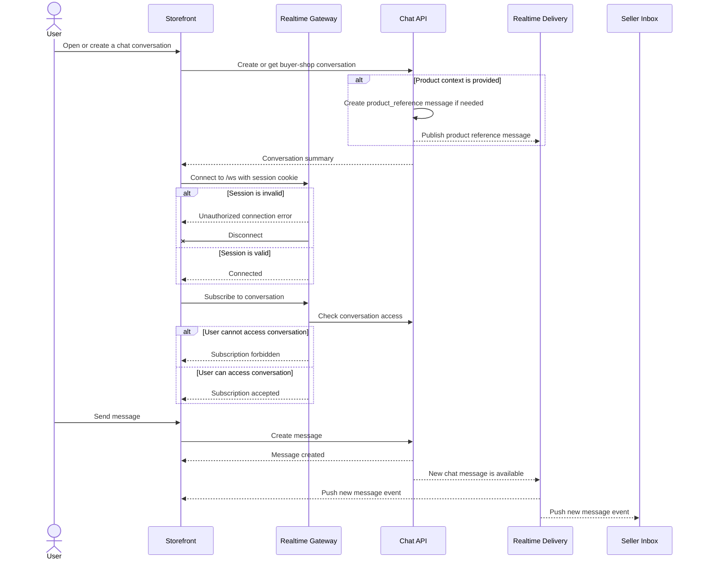

# Realtime Chat Flow

This document captures the end-to-end user-visible and cross-surface flow for realtime chat delivery across storefront and seller chat surfaces.

For feature scope, event shape, and implementation file references, see [README.md](README.md).

## Main Flow

Summary:

- storefront and seller surfaces use REST for authoritative state and websocket delivery for realtime updates
- storefront opens a buyer-shop conversation through REST before subscribing to its realtime room
- product context is sent as a generated `product_reference` message, not as a conversation-level product field
- product-reference snapshot metadata is stored as fallback context; REST message reads provide viewer-specific product-card pricing
- the websocket connection uses the same session boundary as authenticated API requests
- conversation subscription is authorized before a client can receive conversation-scoped events
- newly created messages are pushed to subscribed clients without waiting for polling

## Detailed Flows

- [Conversation Open And Product Reference](flows/conversation-open.md)
- [Message History Pagination](flows/message-history.md)
- [Connection Authentication](flows/connection-auth.md)
- [Conversation Subscription](flows/conversation-subscription.md)
- [Conversation Unsubscribe](flows/conversation-unsubscribe.md)
- [Message Creation And Delivery](flows/message-delivery.md)
- [Mark Conversation Read](flows/mark-read.md)
- [Cross-Instance Delivery](flows/cross-instance-delivery.md)
