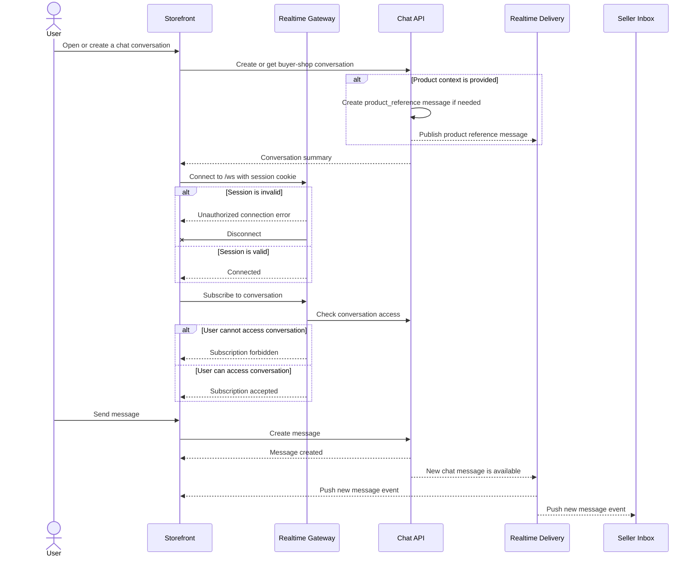
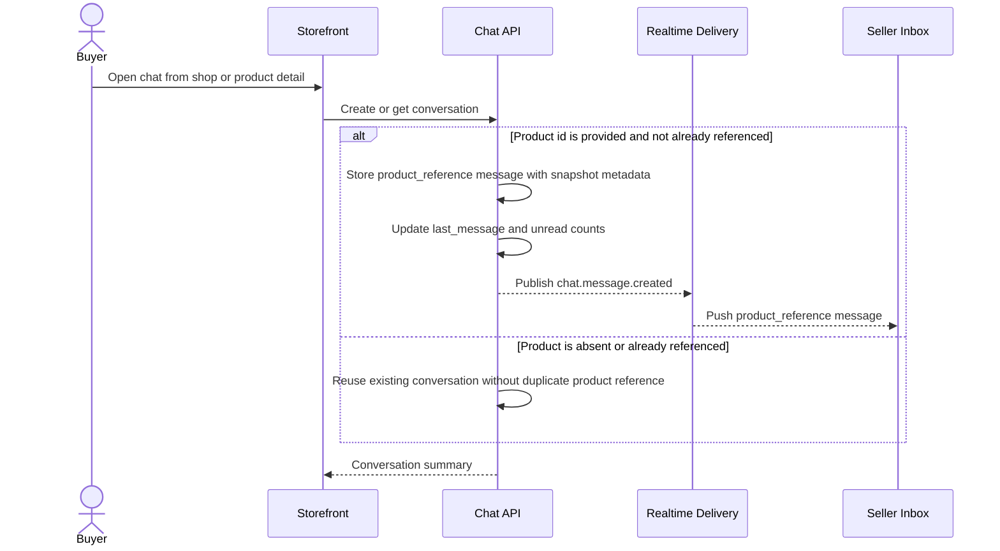
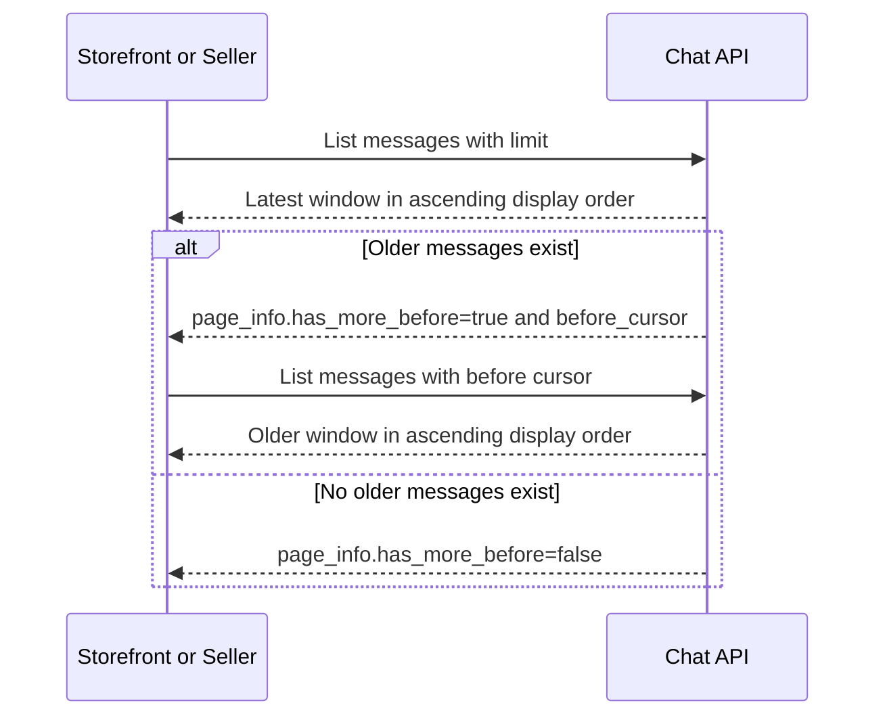
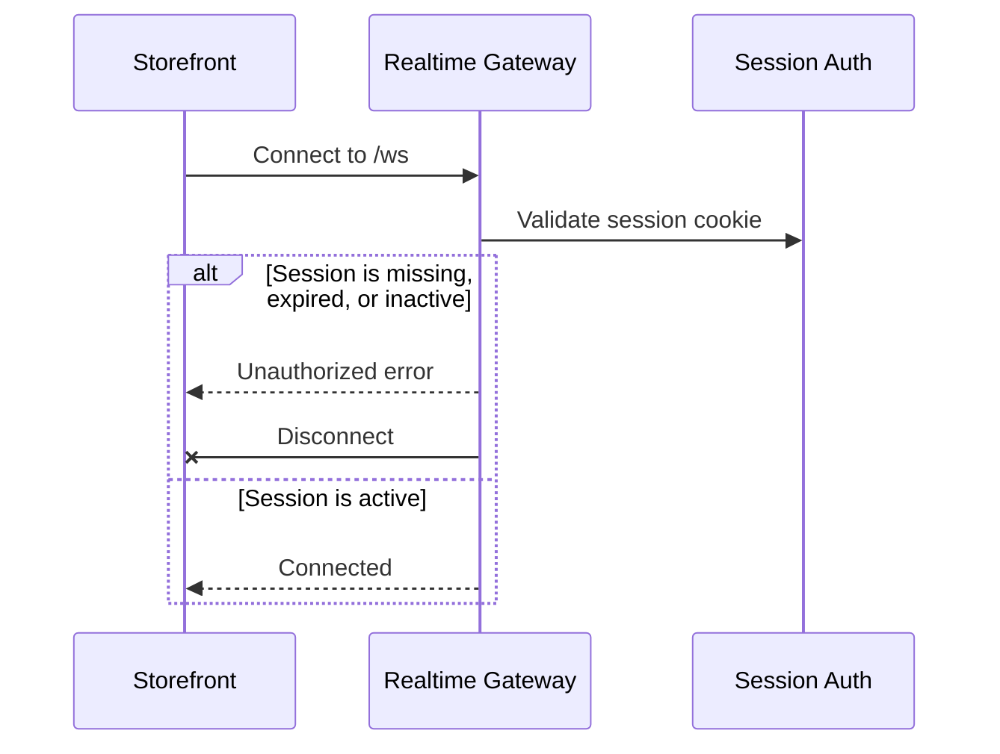
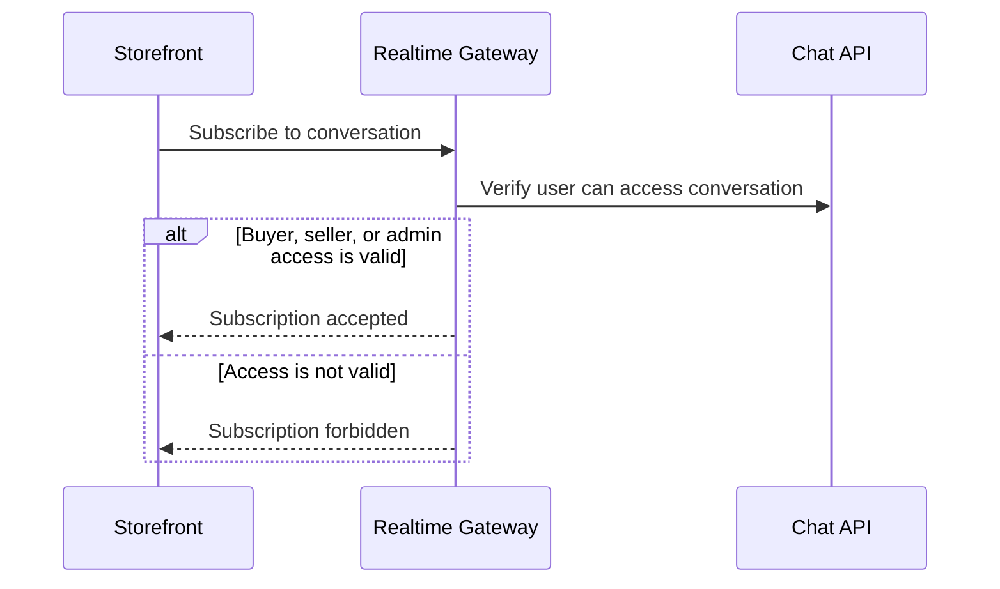
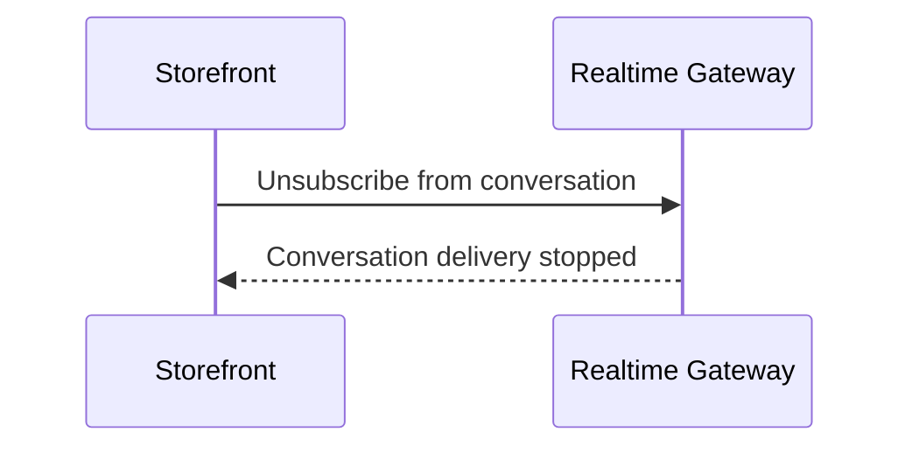
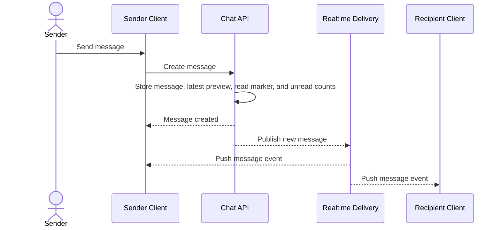
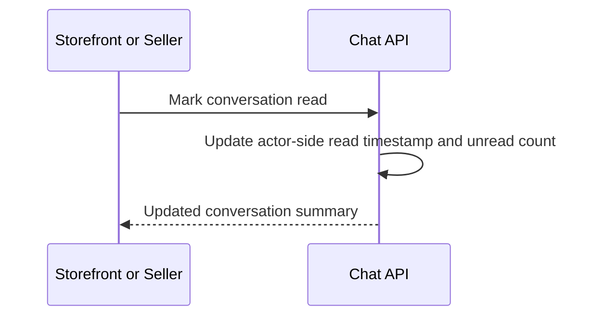
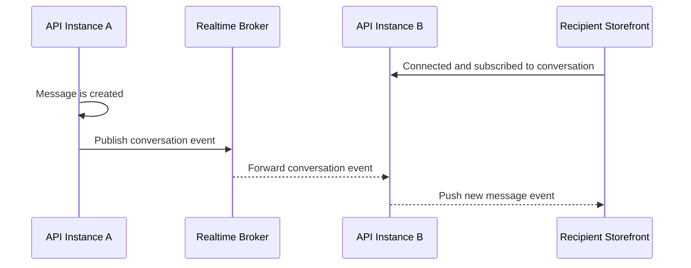

# Realtime Chat Flow

This document captures the user-visible and cross-surface flow for realtime chat delivery across storefront and seller chat surfaces.

For feature scope, event shape, and implementation file references, see [README.md](README.md).

## Main Flow

Summary:

- storefront and seller surfaces use REST for authoritative state and websocket delivery for realtime updates
- storefront opens a buyer-shop conversation through REST before subscribing to its realtime room
- product context is sent as a generated `product_reference` message, not as a conversation-level product field
- the websocket connection uses the same session boundary as authenticated API requests
- conversation subscription is authorized before a client can receive conversation-scoped events
- newly created messages are pushed to subscribed clients without waiting for polling

## Conversation Open And Product Reference

Summary:

- a buyer has one conversation per shop, even when opening chat from multiple products
- product context is preserved as a message with `message_type: product_reference`
- duplicate product reference messages are avoided for the same conversation and product
- the generated product reference increments the seller unread count and becomes the latest message

## Message History Pagination

Summary:

- message history uses cursor pagination instead of page numbers
- `before` points to the oldest loaded message window boundary
- clients merge pages, deduplicate by message id, and keep display order ascending
- conversation list pagination remains page-based

## Connection Authentication

Summary:

- unauthenticated clients cannot keep a realtime connection open
- successful connections are associated with the authenticated user
- the user association is reused for later room subscription checks

## Conversation Subscription

Summary:

- knowing a conversation id is not enough to receive realtime messages
- subscription access is valid for buyers in the conversation, sellers who own the conversation shop, and admins
- forbidden subscriptions fail without joining the conversation delivery channel

## Conversation Unsubscribe

Summary:

- storefront unsubscribes when the active conversation changes or the chat surface unmounts
- leaving a conversation delivery channel does not require another permission check

## Message Creation And Delivery

Summary:

- REST remains the authoritative write path for sending messages
- realtime delivery fans out the created message after the write succeeds, including `message_type` and metadata
- sender and recipient surfaces can receive the same created-message event
- clients patch active message lists, conversation previews, and unread badges until the next REST refetch

## Mark Conversation Read

Summary:

- storefront clears `buyer_unread_count` for the buyer side
- seller clears `seller_unread_count` for the seller side
- read state remains REST-authoritative; websocket events only move counts forward for new messages

## Cross-Instance Delivery

Summary:

- realtime delivery must work when different users are connected to different API instances
- the broker carries room events across instances
- conversation delivery remains addressed by the logical conversation subscription, not by a specific server process
