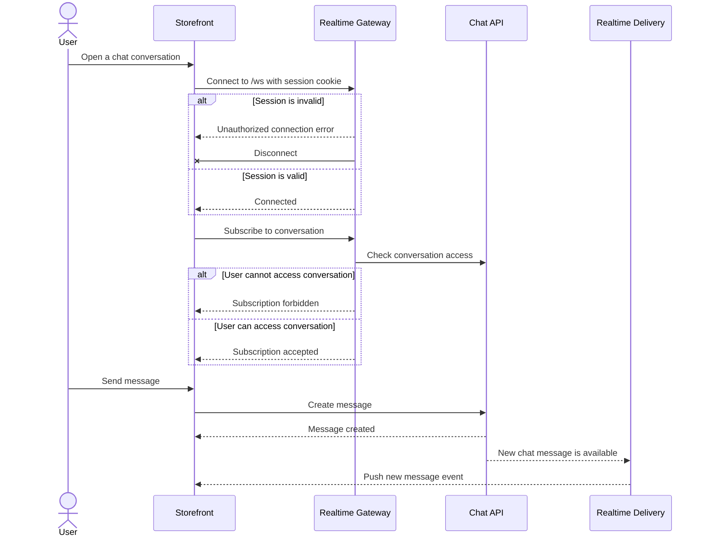
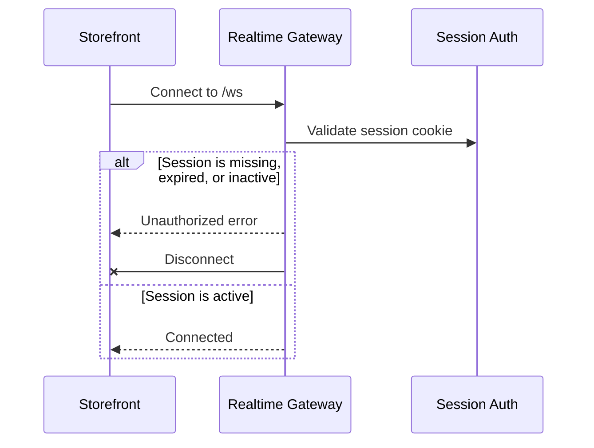
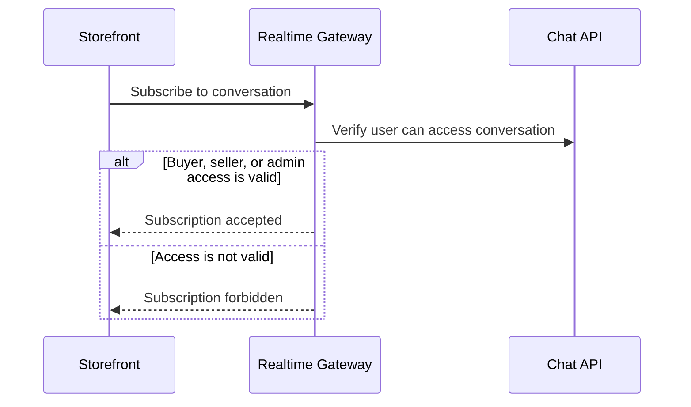
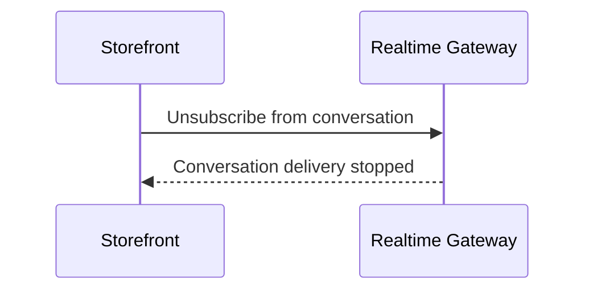
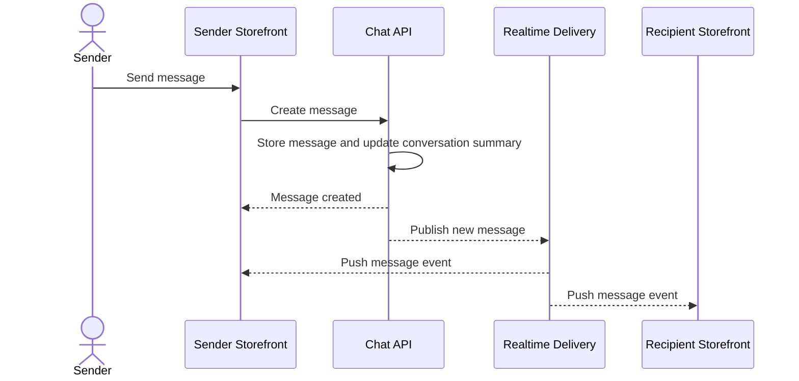
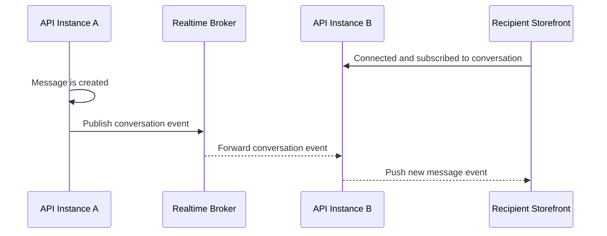

# Realtime Chat Flow

This document captures the user-visible and cross-surface flow for realtime chat delivery.

For feature scope, event shape, and implementation file references, see [README.md](README.md).

## Main Flow

Summary:

- the storefront uses REST for message creation and websocket delivery for realtime updates
- the websocket connection uses the same session boundary as authenticated API requests
- conversation subscription is authorized before a client can receive conversation-scoped events
- newly created messages are pushed to subscribed clients without waiting for polling

## Connection Authentication

Summary:

- unauthenticated clients cannot keep a realtime connection open
- successful connections are associated with the authenticated user
- the user association is reused for later room subscription checks

## Conversation Subscription

Summary:

- knowing a conversation id is not enough to receive realtime messages
- subscription access is valid for buyers in the conversation, sellers who own the conversation shop, and admins
- forbidden subscriptions fail without joining the conversation delivery channel

## Conversation Unsubscribe

Summary:

- storefront unsubscribes when the active conversation changes or the chat surface unmounts
- leaving a conversation delivery channel does not require another permission check

## Message Creation And Delivery

Summary:

- REST remains the authoritative write path for sending messages
- realtime delivery fans out the created message after the write succeeds
- both sender and recipient surfaces can receive the same created-message event

## Cross-Instance Delivery

Summary:

- realtime delivery must work when different users are connected to different API instances
- the broker carries room events across instances
- conversation delivery remains addressed by the logical conversation subscription, not by a specific server process
