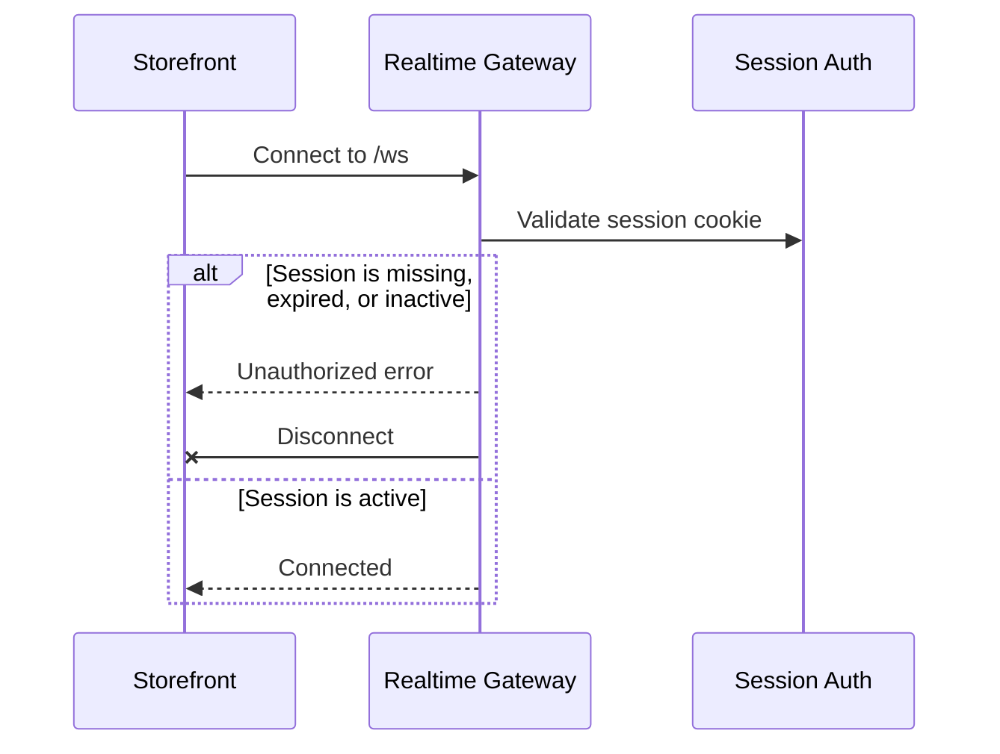

# Connection Authentication

This flow describes how the realtime gateway authenticates websocket connections.

Summary:

- unauthenticated clients cannot keep a realtime connection open
- successful connections are associated with the authenticated user
- the user association is reused for later room subscription checks
