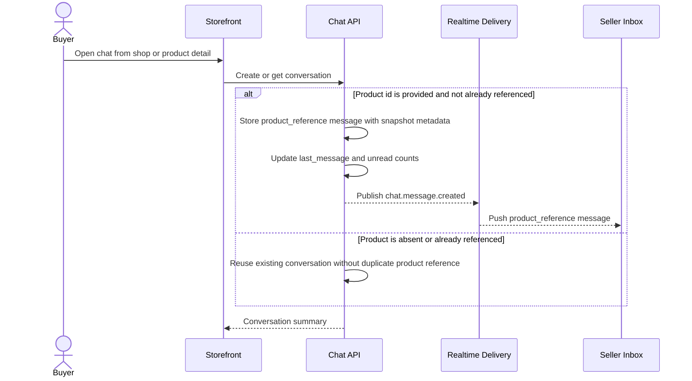

# Conversation Open And Product Reference

This flow describes how storefront opens a buyer-shop chat conversation and preserves product context as a generated message.

Summary:

- a buyer has one conversation per shop, even when opening chat from multiple products
- product context is preserved as a message with `message_type: product_reference`
- duplicate product reference messages are avoided for the same conversation and product
- the generated product reference increments the seller unread count and becomes the latest message
- storefront reads render product-card money in buyer presentment currency, while seller reads render seller-authored base catalog pricing
