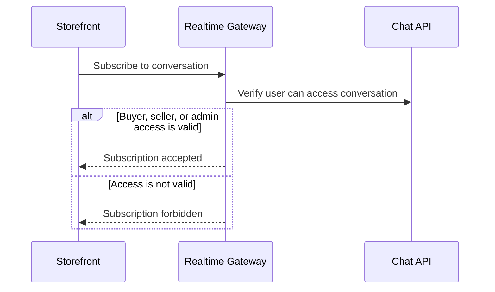
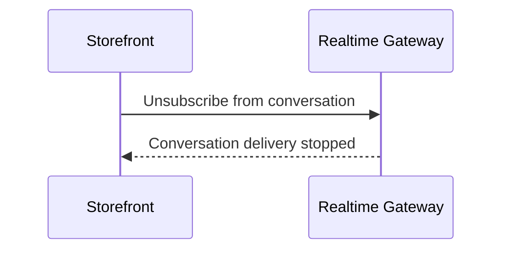

# Conversation Subscription

This flow describes how the realtime gateway authorizes a client before joining a conversation delivery channel.

Summary:

- knowing a conversation id is not enough to receive realtime messages
- subscription access is valid for buyers in the conversation, sellers who own the conversation shop, and admins
- forbidden subscriptions fail without joining the conversation delivery channel

# Conversation Unsubscribe

This flow describes how a client leaves a conversation delivery channel.

Summary:

- storefront unsubscribes when the active conversation changes or the chat surface unmounts
- leaving a conversation delivery channel does not require another permission check