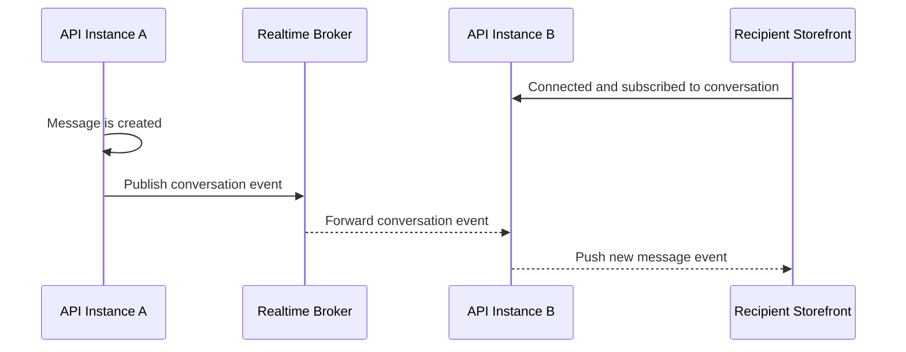

# Cross-Instance Delivery

This flow describes how realtime chat events reach subscribers connected to a different API instance.

Summary:

- realtime delivery must work when different users are connected to different API instances
- the broker carries room events across instances
- conversation delivery remains addressed by the logical conversation subscription, not by a specific server process
