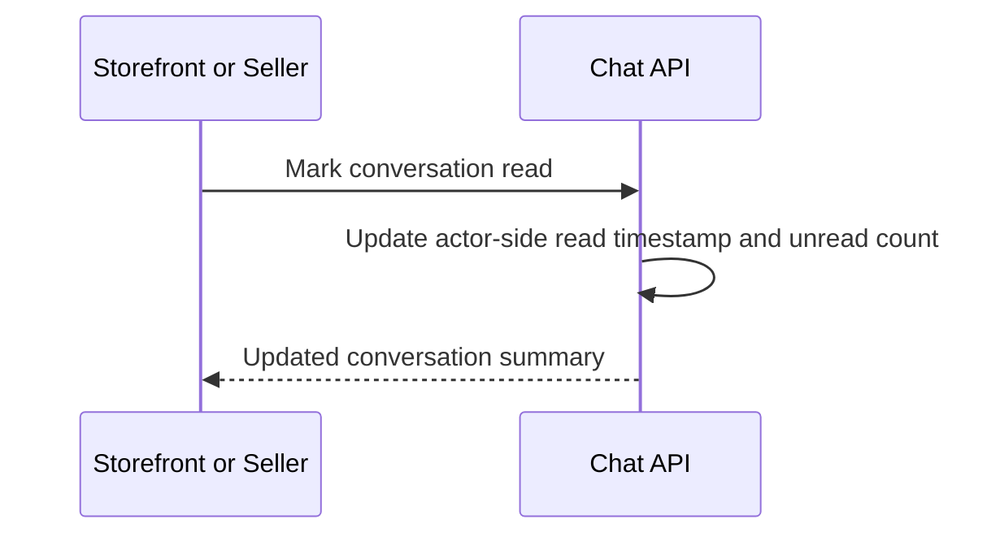

# Mark Conversation Read

This flow describes how clients mark a conversation as read through the REST API.

Summary:

- storefront clears `buyer_unread_count` for the buyer side
- seller clears `seller_unread_count` for the seller side
- read state remains REST-authoritative; websocket events only move counts forward for new messages
