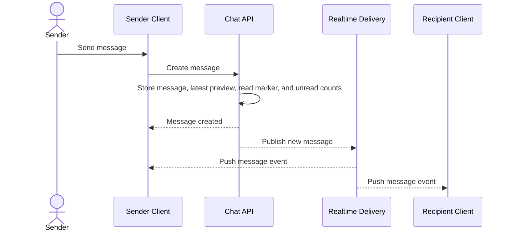

# Message Creation And Delivery

This flow describes how REST message creation fans out through realtime delivery.

Summary:

- REST remains the authoritative write path for sending messages
- realtime delivery fans out the created message after the write succeeds, including `message_type` and metadata
- sender and recipient surfaces can receive the same created-message event
- clients patch active message lists, conversation previews, and unread badges until the next REST refetch
- product-reference events should cause clients to refetch active message history because one event payload cannot carry both buyer-presentment and seller-base product-card pricing
