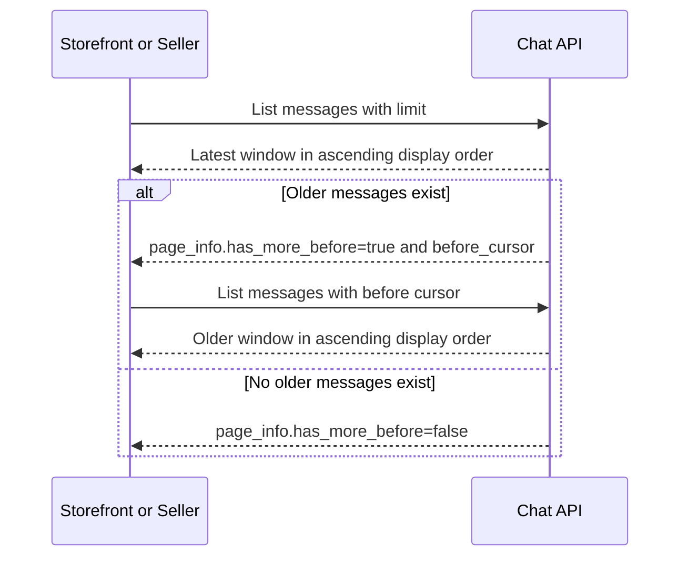

# Message History Pagination

This flow describes how clients load the latest message window and page backward through older messages.

Summary:

- message history uses cursor pagination instead of page numbers
- `before` points to the oldest loaded message window boundary
- clients merge pages, deduplicate by message id, and keep display order ascending
- REST message responses are the authoritative source for product-reference card display pricing
- conversation list pagination remains page-based
